# KLIF

<p align="center">
  
</p>

<p align="center">
  <strong>Koksny.com LOCAL INFERENCE FORNICATOR</strong><br>
  AMD optimized frontend for transformers and DiT.
</p>

<p align="center">
  
  
  
  
  
  
</p>

<p align="center">
  <a href="https://www.youtube.com/watch?v=MAE393AL5As">
    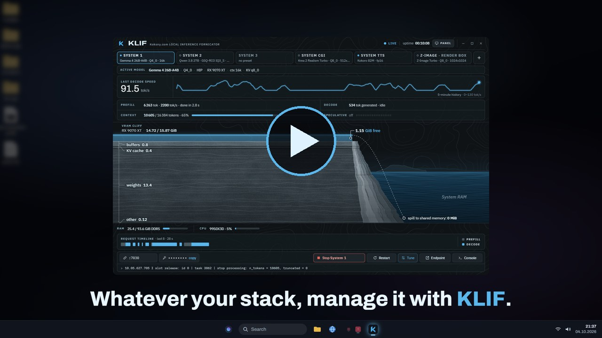
  </a>
</p>

<p align="center">
  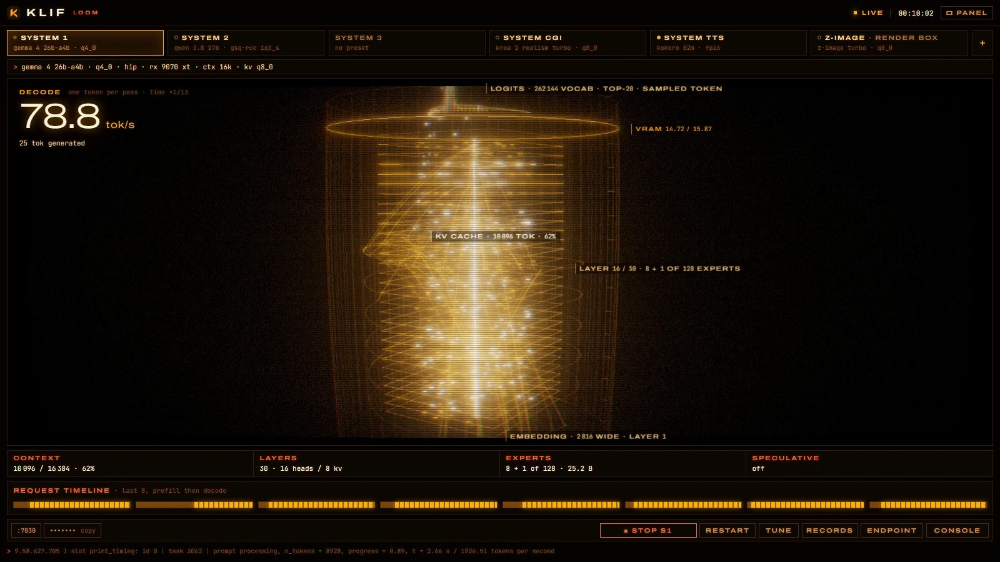
  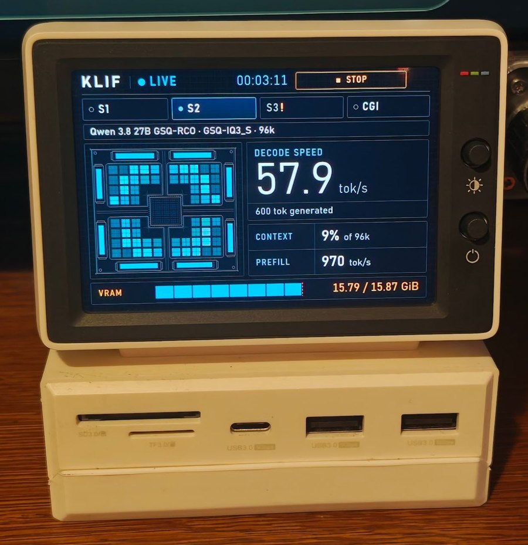
  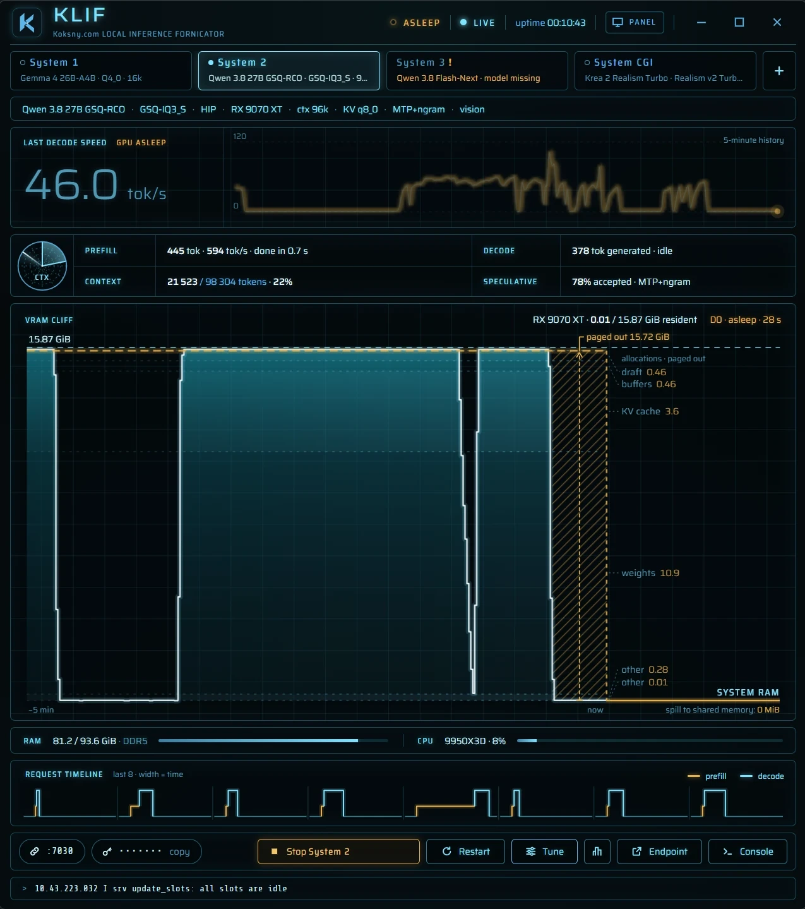
</p>
<p align="center"><sub>The mock engine in the Loom skin · the 960×640 panel on a desk · a real session, the GPU asleep between requests</sub></p>

KLIF manages a local inference stack from one window: the language-model, image, speech, transcription, music and
video servers you already run, on one machine or several. Each server is a **System**: a tab with a live status, the
exact command line that starts it, and what it is doing to your GPU right now. `klif-cli` does the same from a
terminal or a coding agent, and klif-webui from a phone.

KLIF runs on Windows, where it is built and tuned for AMD GPUs, on macOS with Apple silicon, and on Linux. One machine
can launch and stop Systems on another, a Mac on a Windows desktop and the other way round.

KLIF is not a model zoo and not an inference runtime. llama.cpp, stable-diffusion.cpp, vLLM and the rest are
separate projects you install yourself; KLIF starts them, watches them and stops them. No weights are shipped.

## Why KLIF exists

KLIF was built for daily work with local models on one desk, and that is still what it is for.

Running a local stack by hand ends as a folder of launch scripts, quants that behave differently under HIP and under
Vulkan, and a coding agent that has to guess which script is the current one and why the other file is the one that
actually works. KLIF replaces that with one source of truth: every server's command line, visible and editable in
one place, started and stopped from one window, next to the state of the GPU it runs on.

It is published because it works and holds up in daily use. It is not a product with a roadmap for everybody:
features land when they solve a real problem in that daily work.

## Why a GUI?

If you are happy driving your models from a terminal, keep doing that. There are thirty kinds of terminals, and a
launcher script of your own is a weekend's work.

KLIF is for the other case: several servers at once, one glance to see what each of them is doing, no hunting for
the right script. Everything the window does is also in `klif-cli`, so scripts and agents are covered as well.

## Skins

Nine looks over the same data. Every skin has a full window and a 960×640 layout for a small status screen, such as
a 3.5-inch USB display next to the monitor.

**Live decode**, a language model answering requests. Top row: the full window. Bottom row: the 3.5-inch panel.
Left to right: Cliff, Silicon, Instrument, Phosphor, Decode, Loom, Ether, Rings, Spirit.

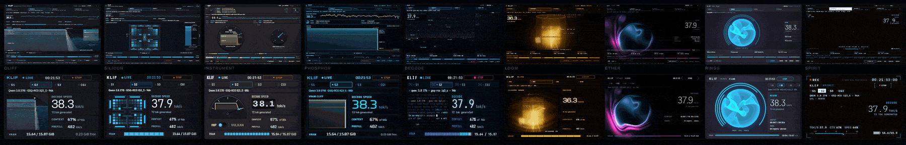

<details>
<summary><strong>Prefill, image generation, startup</strong></summary>

**Prefill**, a long prompt being read in:

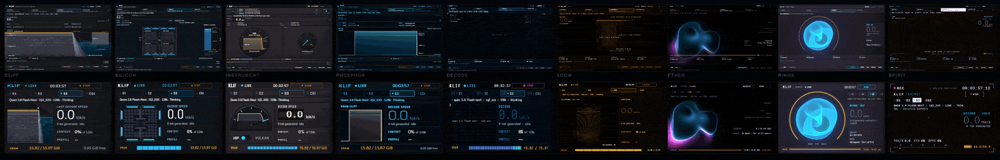

**Image generation**, a diffusion job stepping through its schedule:

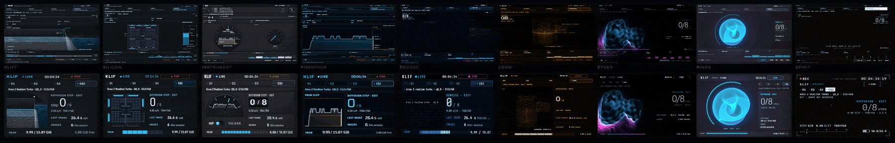

**Startup**, a System loading its model:

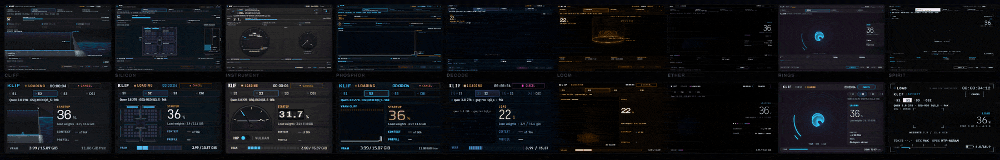

</details>

The animations come from the browser mock engine with recorded timings, the same data in every skin.

## What it does

- **Systems as tabs.** You define the Systems you have: "System 1", "System 2", "System CGI", "System TTS", or
  anything else. Kinds are `llm`, `image`, `tts`, `stt` and `video`. Each tab shows online, busy, starting, offline,
  not set, invalid, fault or unreachable. [docs/systems.md](docs/systems.md)
- **Several at once.** Every System has its own server, session, logs and telemetry. Before a launch KLIF checks for
  port clashes, an `exclusive` System on the same GPU and free VRAM, and names what would have to stop. It never
  kills a process it does not own.
- **Other machines and servers you do not start.** A System can be an external server that KLIF only watches, or
  live on another computer running KLIF (a remote node, opt-in, token-authenticated). [docs/nodes.md](docs/nodes.md)
- **Commands you can read.** A preset is the launch command: program, argument list, working folder, environment.
  The Tune drawer, `klif-cli plan` and `klif.toml` show the same thing, and what you see is what runs. Presets can
  declare independent params (reasoning on or off, image size) instead of one preset per combination.
  [docs/presets.md](docs/presets.md)
- **Adapters, not a fixed list.** `llama.cpp`, `sd.cpp`, `vllm`, `openai` (any OpenAI-compatible server) and
  `generic` (any program that listens on a port). The adapter decides defaults and which log lines and endpoints
  KLIF reads for telemetry.
- **klif-cli.** Status, plan, launch, stop, presets, params, bench, downloads, keys and nodes, with `--json` and a
  stable `schemaVersion`. [docs/cli.md](docs/cli.md)
- **klif-webui.** An opt-in page for a phone or a browser on your network: every System's status, with launch, stop,
  restart, preset and params. Devices pair with a QR code; it is off by default and plain HTTP, so use it on a network
  you trust. [docs/webui.md](docs/webui.md)
- **Models that fit this machine.** KLIF knows every GPU and the CPU, their theoretical FP32 TFLOPS and the VRAM
  and RAM they add up to, and suggests a model from its embedded pool for each System: quant, context and KV type
  sized to the memory that System may use. It downloads from huggingface.co only when you ask. The suggestions are
  estimates; benchmark and calibrate on your machine (`klif-cli bench <system>`). Each model keeps its own license.
- **Records.** The best decode and prefill speed, time to first token and time per image that each model file
  reached on each backend, from everyday use, on a Records screen with cards you can share as images. Every skin
  celebrates a new one.

## Requirements

- Windows 10 or 11, 64-bit, with the Microsoft Edge WebView2 runtime (part of Windows 11 and of most up-to-date
  Windows 10 installs).
- Or macOS 13 or later on Apple silicon (M1 or newer): tested on an M4 with a Metal build of llama.cpp. KLIF reads
  the GPU through Metal and the IORegistry; nothing needs administrator rights. [docs/platforms.md](docs/platforms.md)
- Or Linux x86_64 with WebKitGTK 4.1 (tested on Ubuntu 24.04 in WSL2; GPU memory readings are untested so far).
  [docs/platforms.md](docs/platforms.md#linux-specifics)
- An AMD GPU is the first-class target: the tested setups run HIP (ROCm) and Vulkan builds of llama.cpp and
  stable-diffusion.cpp. GPU memory is read through DXGI and Windows performance counters, which are not
  AMD-specific, but nothing else is tested. [docs/platforms.md](docs/platforms.md)
- The servers you want to run and their model files, in folders you choose. KLIF starts them; it does not install
  them.

## Quick start

1. **Get KLIF.** Download `KLIF-<version>.zip` (Windows), `KLIF-<version>-macos-arm64.zip` (macOS) or
   `KLIF-<version>-linux-x86_64.tar.gz` (Linux) from [Releases](https://github.com/koksny/klif/releases), unpack it
   anywhere and compare the SHA-256 with the one on the release page: `Get-FileHash -Algorithm SHA256 .\klif.exe` on
   Windows, `shasum -a 256 <file>` on a Mac, `sha256sum <file>` on Linux.

   Or build it: Rust 1.90+ (MSVC toolchain), Node.js 20.19+ or 22.12+ with npm, then from a clone

   ```powershell
   .\scripts\Build-Release.ps1
   ```

   which puts `klif.exe` and `klif-cli.exe` into `dist\KLIF\` and prints their SHA-256. On a Mac (Xcode Command
   Line Tools, Rust, Node.js):

   ```bash
   ./scripts/build-release.sh
   ```

   puts `KLIF.app` and `klif-cli` into `dist/KLIF/`, zips the folder and prints the SHA-256 of each. An unsigned
   build from someone else is stopped by Gatekeeper the first time: [docs/platforms.md](docs/platforms.md#gatekeeper).
   On Linux (the packages in [docs/platforms.md](docs/platforms.md#linux-specifics)), `./scripts/build-release-linux.sh`
   puts `klif` and `klif-cli` into `dist/KLIF/` and packs a tar.gz.

2. **Configure.** Start KLIF (`klif.exe`, `KLIF.app` on a Mac, `klif` on Linux) with no configuration and use **Add a
   System**, or copy [config/klif.example.toml](config/klif.example.toml) to `%APPDATA%\KLIF\klif.toml` (macOS:
   `~/Library/Application Support/KLIF/klif.toml`, Linux: `~/.config/klif/klif.toml`) and replace the fictional
   paths (`D:\llama.cpp`, `D:\models`, `192.0.2.x`) with yours. `klif-cli` reads the same file; `KLIF_CONFIG` points
   it at another one.

3. **Look before you launch.**

   ```powershell
   klif-cli status
   klif-cli plan s1
   ```

   `plan` prints the program, arguments, working folder and environment that Launch would use, secrets masked.

4. **Launch.** Select a tab and press Launch, or `klif-cli launch s1 --yes --wait`. Closing KLIF does not stop the
   servers; the next KLIF adopts them. Stop them from KLIF or with `klif-cli stop --all --yes`.

5. **Models.** Set `[paths] models_dir`, then use **Recommended** in the Tune drawer, or `klif-cli models list` and
   `klif-cli models download <id> --yes`.

A second computer running KLIF can offer its Systems to this one. Read [docs/nodes.md](docs/nodes.md) before you
enable it: a default install opens no network port.

Windows Defender or SmartScreen may flag an executable that starts other programs and has no reputation yet.
[docs/windows-defender.md](docs/windows-defender.md) explains what KLIF does to avoid that, how to verify a build, and
how to report a false positive.

## For coding agents

KLIF is meant to be driven by agents as much as by hand. [AGENTS.md](AGENTS.md) is the briefing: the repo map, the
`klif.toml` schema, the `klif-cli` JSON contract, the bench-and-calibrate loop, and the safety rules. An Agent Skill,
[skills/klif/SKILL.md](skills/klif/SKILL.md), ships in the release folder too: `klif-cli help --json` lists every
command, `klif-cli schema` gives the JSON Schema of every output, and `klif-cli watch` replaces polling loops.

Good jobs for an agent:

- tune and calibrate an installed KLIF for your hardware with `klif-cli bench`;
- write presets for models other than the defaults;
- port KLIF to another GPU vendor or OS, along the seams in [docs/platforms.md](docs/platforms.md).

Anything an agent sends back as a pull request meets the same bar as a human's, below.

## Changelog in screenshots

The full notes are in [CHANGELOG.md](CHANGELOG.md).

| Version | Screenshot | What it was |
| --- | --- | --- |
| **indev** | 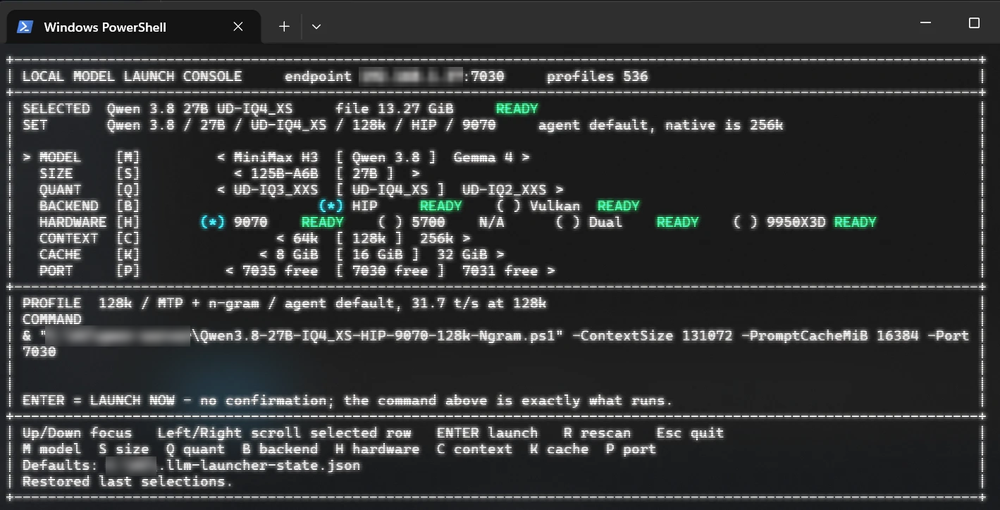 | A PowerShell menu: pick a model, size, quant, backend, GPU, context and port, see the exact command, press Enter. One machine, one server at a time. |
| **0.1** | 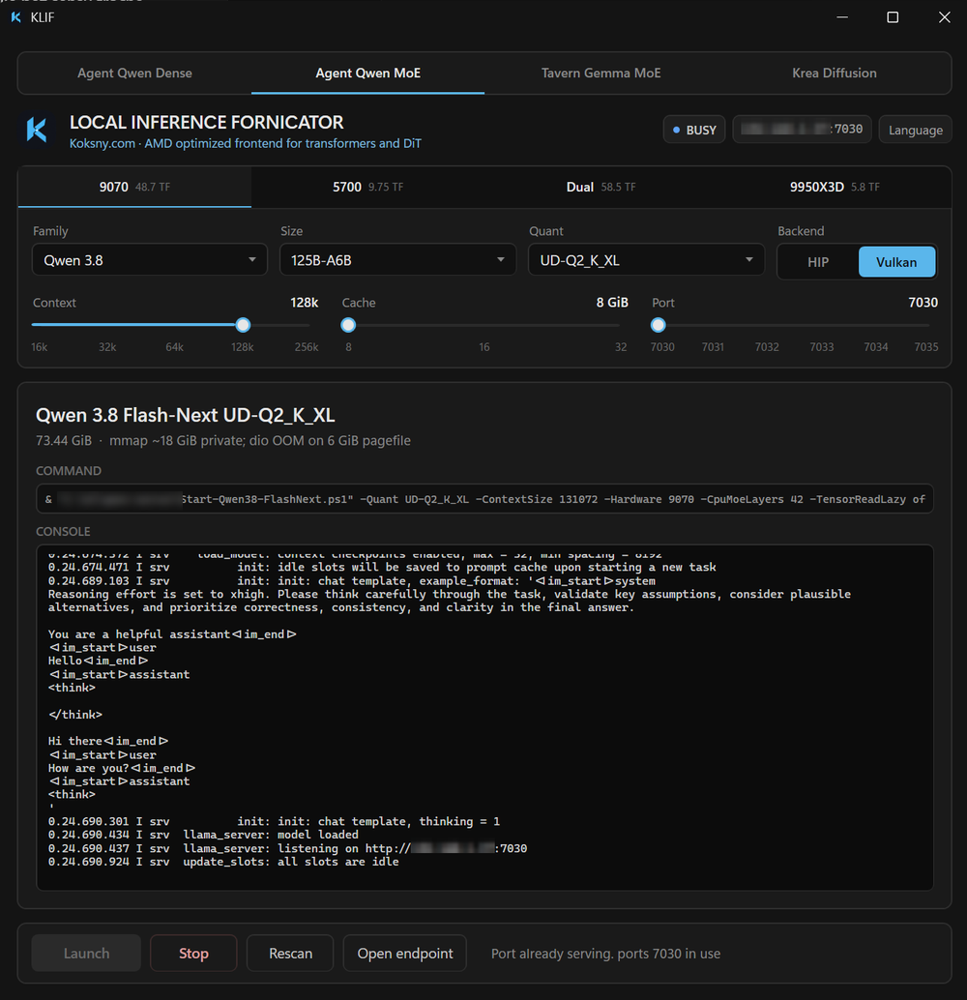 | The same idea in a window: one tab per model tier, the command and the live console, Launch and Stop. It lived in a private workshop; the public 0.1 tag set up the name, the mark and the license. |
| **0.2** | 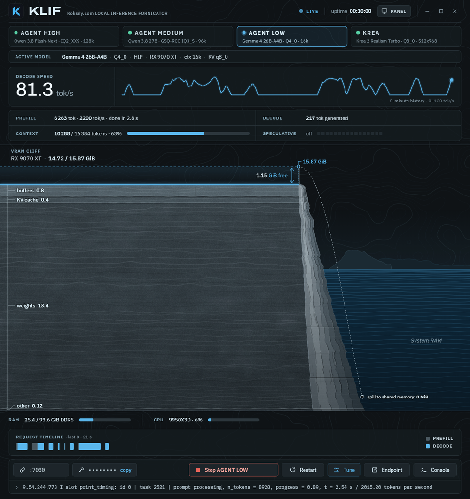 | The first version with running code: a native core and `klif-cli`, a Tauri shell, model tiers as tabs, live GPU memory and telemetry, a panel mode for a 3.5-inch screen, and skins (four, then nine). |
| **0.3** | 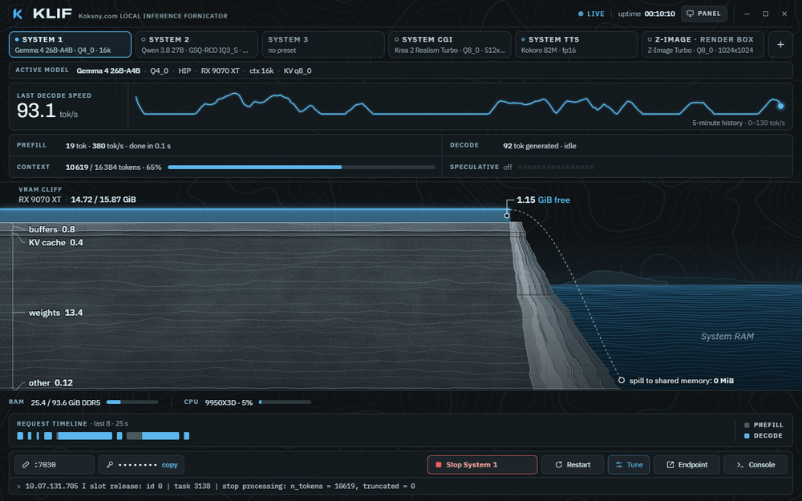 | A manager for the whole stack: any number of Systems side by side, other machines and external servers, editable commands, recommendations and downloads, and a CLI built for agents. |

## Contributing

KLIF is maintained for its author's daily use, with the author's time and tokens. A pull request is welcome when it
meets both of these:

- **Quality.** Work at the level of a frontier coding model at its best (Opus 5.5 class or better), verified three
  times: it builds and passes the checks; an independent review (a session or model that did not write it) found
  nothing left to fix; and it was run on real hardware, with the evidence in the PR.
- **Use.** It fixes a real bug, or it adds something that makes daily work with local models better for the
  maintainer as well. A feature nobody here needs is better kept in a fork, and that is fine.

The checklists, the privacy rules and the development setup are in [CONTRIBUTING.md](CONTRIBUTING.md). Pull requests
that miss the bar are closed without a long discussion. That is about time, not about you.

## Docs

- [Overview](docs/overview.md): how the pieces fit, files, ports
- [Systems](docs/systems.md): kinds, statuses, conflicts, external servers
- [Presets](docs/presets.md): launch commands, placeholders, params, adapters, recommendations
- [klif-cli](docs/cli.md): every command and the JSON contract
- [Nodes](docs/nodes.md): several machines, rights, the security model
- [klif-webui](docs/webui.md): the control page for a phone, pairing, the security model, the API
- [Platforms](docs/platforms.md): Windows with AMD, macOS with Apple silicon, Linux, what each tests; other GPUs and
  systems through pull requests
- [Windows Defender and SmartScreen](docs/windows-defender.md)
- [Brand](docs/brand.md), [Publishing](docs/publish.md), [Changelog](CHANGELOG.md), [Security](SECURITY.md)

## License

MIT, see [LICENSE](LICENSE). Model weights you load through KLIF keep their own licenses, and so do the runtimes
(llama.cpp, stable-diffusion.cpp, vLLM, ComfyUI and others).

AMD, Radeon, ROCm, NVIDIA, CUDA, Hugging Face and other names are trademarks of their owners. KLIF is an independent
project, not affiliated with or endorsed by any of them.
