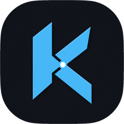

# KLIF

  

  <strong>Koksny.com LOCAL INFERENCE FORNICATOR</strong> 
  AMD optimized frontend for transformers and DiT.

Windows launcher for local inference on AMD GPUs: language models (transformers) and image/video diffusion transformers via HIP/ROCm and Vulkan.

**0.1** is the public project identity. The launcher, model cards, and runtime glue land here as they stabilize. Weights are never shipped.

## What this is

KLIF is a frontend, not a model zoo.

- One WPF launcher to start local servers
- llama.cpp-class stacks for chat / agents (HIP or Vulkan)
- sd-server for image and video DiT on HIP
- A small web UI for generation jobs

You bring your own GGUF / safetensor files. KLIF only wires backends, VRAM budgets, and a UI around them.

## Status

| Piece | In this repo |
| --- | --- |
| Branding, license, docs | yes |
| Launcher / starters / web UI | not yet — private tree until a drop is worth publishing |
| Model weights, HIP fat binaries, logs | never |

See [docs/overview.md](docs/overview.md) for the intended layout, and [docs/publish.md](docs/publish.md) before copying anything into this tree.

## Requirements (when the launcher lands)

- Windows 10/11
- PowerShell 5.1+
- An AMD GPU with a HIP (ROCm) or Vulkan path
- Local weights (GGUF / safetensors) under a directory you choose

## Docs

- [Overview](docs/overview.md) — components and ports
- [Brand](docs/brand.md) — accent and mark
- [Publishing](docs/publish.md) — what may enter git, what must not
- [Changelog](CHANGELOG.md)
- [Contributing](CONTRIBUTING.md)

## License

MIT. Model weights you load through KLIF keep their own licenses. Third-party runtimes (llama.cpp, sd.cpp, ComfyUI, and so on) keep theirs too.
